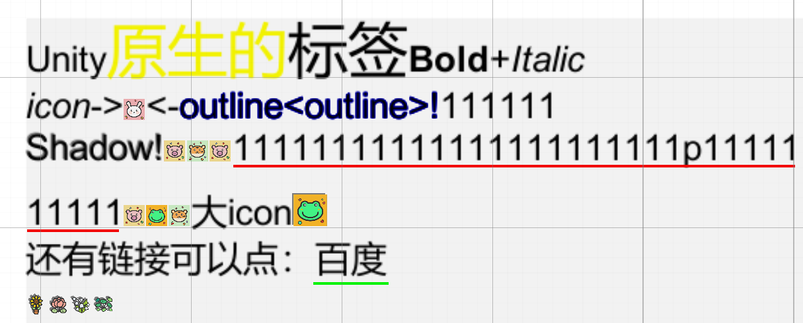

# SSRichText
 Unity UGUI RichText

实现思路来自：[ZUIRichText](https://github.com/172672672/UGUI-RichText)

GIF解码思路来自：[UnityGif](https://github.com/SleepyLoser/UnityGif) 和 [GIF图解和压缩详解](https://blog.csdn.net/wzy198852/article/details/17266507)

使用的图标来自：
[阿里图标库大头贴](https://www.iconfont.cn/collections/detail?spm=a313x.collections_index.i1.d9df05512.168b3a81l8GbZU&cid=50743)
[阿里图标库多彩小植物](https://www.iconfont.cn/collections/detail?spm=a313x.collections_index.i1.d9df05512.675d3a81CPSoFN&cid=50664)

使用的GIF图来自**网络**

## 支持

Unity版本：Unity2020或以上经过测试可用，Unity2019及以下或Unity6均未测试

支持的富文本标签：

|            标签             | 效果  |                     注释                      |
|:-------------------------:|:---:|:-------------------------------------------:|
|         \<b>\</b>         | 粗体  |                   unity原生                   |
|         \<i>\</i>         | 斜体  |                   unity原生                   |
|      \<size>\</size>      | 大小  |                   unity原生                   |
|   \<color=red>\</color>   | 颜色  |                   unity原生                   |
| \<outline=red>\</outline> | 描边  |   \<outline=red>或\<outline=#ffffffff>设置颜色   |
|    \<shadow>\</shadow>    | 阴影  |                     ...                     |
|       \<icon=xxxx/>       | 图标  |             需要配合IconProvider使用              |
| \<underline>\</underline> | 下划线 | \<underline=red>或\<underline=#ffffffff>设置颜色 |
|    \<link=url>\</link>    | 链接  |               url可以填写具体的链接地址                |
|       \<gif=xxxx/>        | 动图  |        需要配合GifDecoder和LoadManager使用         |

支持富文本点击事件：

|         标签          |  事件消息   |       参数       |                       备注                        |
|:-------------------:|:-------:|:--------------:|:-----------------------------------------------:|
| \<link=url>\</link> | OnClick |   type, url    |                        -                        |
|    \<icon=xxxx/>    | OnClick | type, iconName |                        -                        |
|    \<gif=xxxx/>     | OnClick | type, gifName  |                        -                        |
|         默认          | OnClick |   type, 文本内容   | 包含outline、underline、shadow以及原生支持的color、size、b、i |

## 已实现或规划中功能

- [x] outline描边标签
- [x] shadow阴影标签
- [x] underline下划线标签
- [x] icon图标标签
- [x] link标签
- [x] 富文本点击事件
- [x] GIF显示在富文本
- [ ] GIF的文本渲染到帧图上

# 效果图

